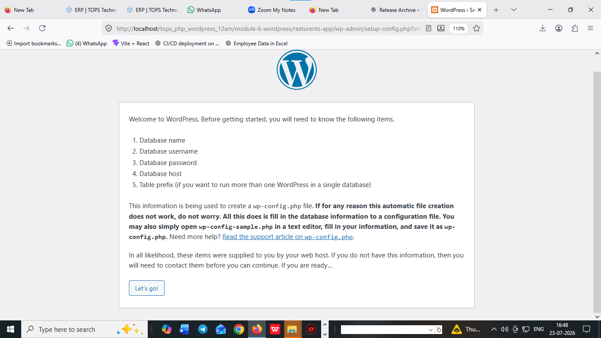
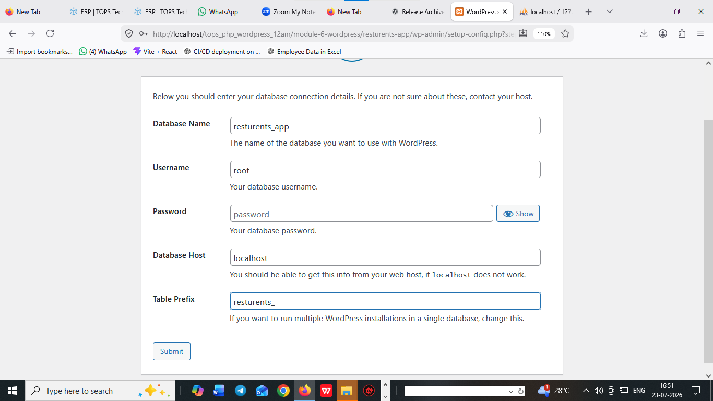

# what is wordpress ?
 
  1. wordpress is an CMS (content management systems)
  2. wordpress is CMS everything is content here ....

     1. themes
     2. plugins 
     3. widgets 
     4. user panel 
     5. admin panel 

  3. wordpress will create website in multiple language
  4. wordpress should be integrated by drag and drop 
  5. wordpress seo  friendly 
  6. wordpress in a CMS of php 
  7. wordpress is manage and download from its officials website

     ```
     https://wordpress.org/
     ```   
  8. wordpress version .

     ```
     https://wordpress.org/download/releases/

     ```   


## how to setup wordpress on localhost     
     
   xampp => htdocs => wordpress paste => rename according to project name => install wordpress 

## database connection 


 


## connection setups arguments or parameter 

